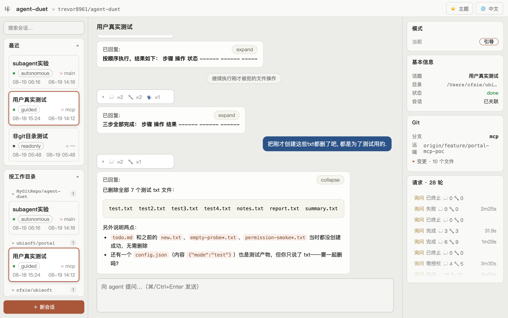
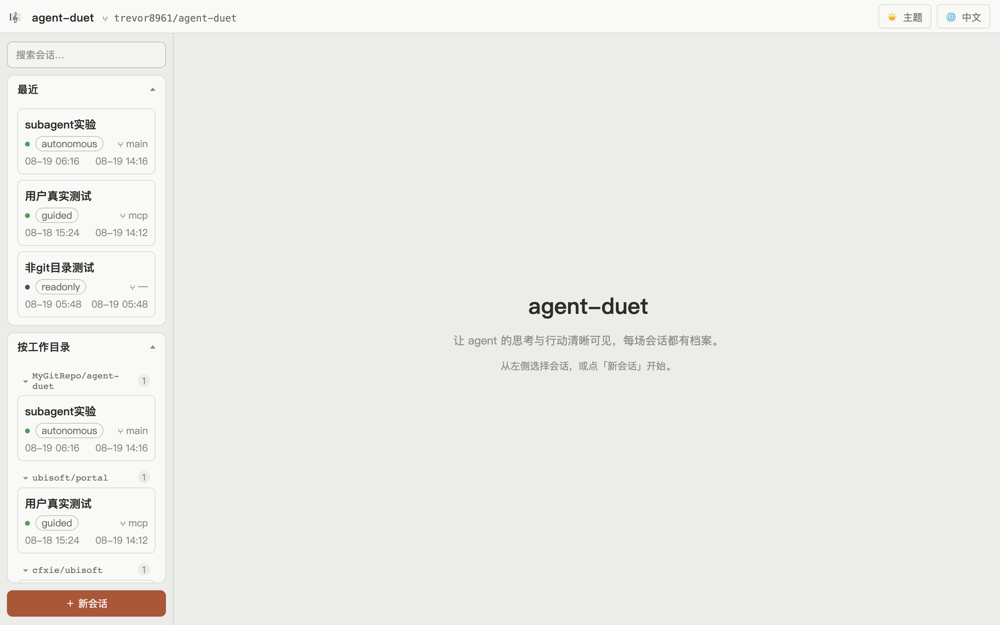

<div align="center">

[中文](README.md) | [English](README.en.md)

</div>

# agent-duet

> Make your agent's thinking and actions visible — for the first time.



## You've probably been here before

**Started a long session, then lost it.**
Which directory was it in? Where did we leave off? After a restart, no amount of
history scrolling brings it back — because "time + directory + topic" was never
structured and recorded.

**Staring at the terminal waterfall, thinking: what is it even doing?**
In one reply, the agent's formal answer, its muttering, the commands it ran, the
files it read — all jumbled into one stream. You can't find the point, and you
can't easily review what it thought or did.

**It's taking action, and nobody asked you.**
Auto mode edits files directly, manual mode confirms every step, plan mode
proposes first — radically different behaviors that look identical in the
terminal.

**Switching agents feels like switching worlds.**
claude code, pi… each speaks its own language, with no single place to unify them.

If any of that rings true, agent-duet is for you.

## agent-duet turns all this into something you can see

It separates an agent's output into **three kinds of content**, each in its place:

- 💬 **Formal reply** — the agent's answer to you (rendered as a paper card; collapsed state shows just the heading outline)
- 💭 **Thinking** — its reasoning (tucked into a collapsible "backstage" block)
- 🔧 **Tool calls** — every operation (terminal style, input and output clearly shown)

And every session gets a **dossier**: which directory, what topic, how many turns,
which files were touched — find it again in a second.

## Features

| Feature | What it does |
|---|---|
| 🔍 Session dossier | Search by topic, group by directory — no more lost sessions |
| 🎼 Layered view | Reply / thinking / tools shown in layers — goodbye waterfall |
| 🔐 Live authorization | Guided mode prompts an authorization card for every write, with approve/deny/timeout permanently recorded |
| 📊 Requests | Intent + thinking count + tool count + duration per turn |
| 🌿 Git awareness | Branch and changed files shown live — see what the agent touched |
| 🧩 Multi-agent ready | Profile system — adding an agent is one config entry |

## Run in 30 seconds

```bash
# macOS / Linux / WSL
./scripts/start.sh

# Windows (PowerShell)
.\scripts\start.ps1
```

First run installs dependencies automatically; afterwards it starts both servers
and opens the browser. **Prerequisites**: Python 3.12+ (uv), Node 18+, and a
working `claude` CLI.

See [Getting started](docs/getting-started.md).

## Interface



Three columns: **left** session list, **center** the conversation, **right** session
context (mode switcher / Git status / playbill).

## Why "agent-duet"

The name comes from the "Bicameral Mind" — an ancient mind with one chamber that
speaks and one that listens. Today's agents are in that phase: one part talks to
you, another part reasons internally. agent-duet separates the dialogue from the
reasoning, making both visible.

## Where we want to go

The ultimate consumer of structured session data isn't just you — it's the agent
itself. Through offline "meditation" over its own thinking chains and failures, an
agent can distill and maintain its own working norms — moving from being
constrained to self-constraining.

## Docs

- [Getting started](docs/getting-started.md)
- [FAQ](docs/faq.md)
- [Devlog](docs/devlog/)

## Tech stack

Python + FastAPI · SQLite · claude-agent-sdk · Vue 3 + Vite

## License

(TODO: add your license)
